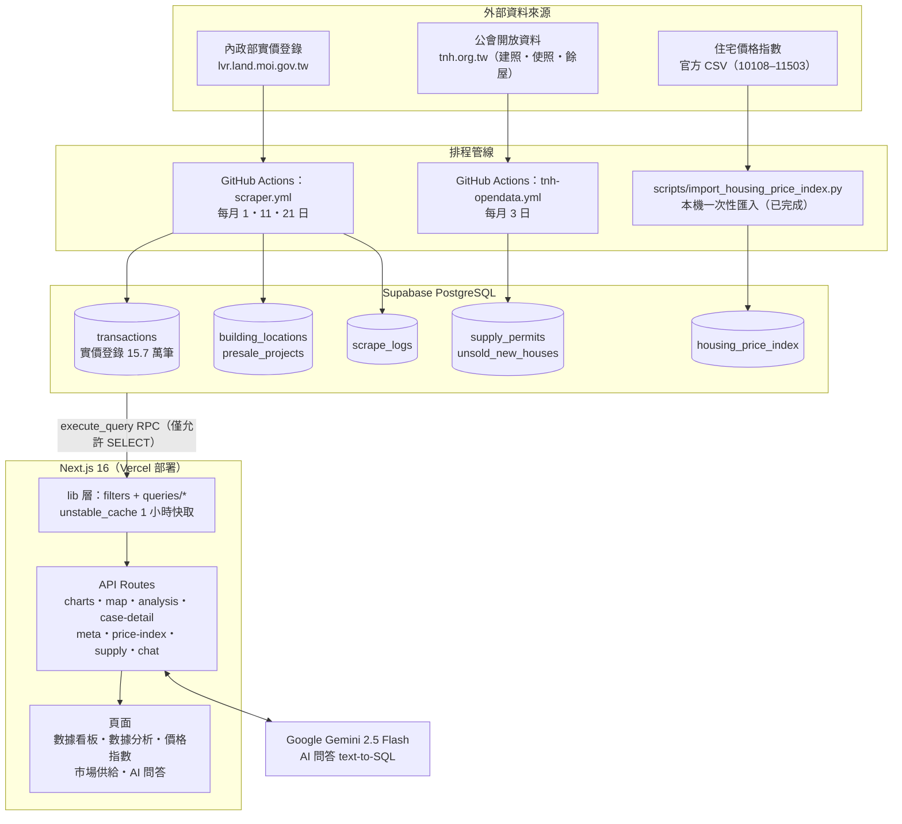
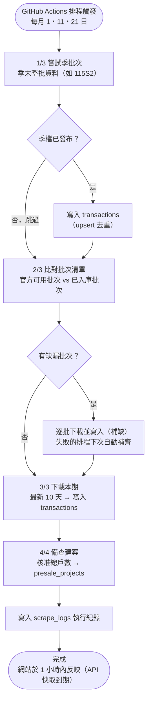

# 系統架構與資料流程

> 最後更新：2026-06-11

## 系統架構圖

由上而下分為四層：資料來源 → 排程管線 → 資料庫 → 應用層。
三條資料線各自獨立運作，互不影響。

### 架構說明

| 層級 | 說明 |
|------|------|
| 資料來源 | 實價登錄（成屋＋預售屋）每 10 天更新一批；公會開放資料含建照/使照（月）與新建餘屋（季）；價格指數為官方研究報告靜態資料（基期 110 年 1 月 = 100） |
| 排程管線 | 兩條 GitHub Actions 排程獨立執行，皆透過 `SUPABASE_SERVICE_ROLE_KEY`（repo secret）寫入；所有寫入採 upsert 去重，重複執行不會產生重複資料 |
| 資料庫 | 應用層只透過 `execute_query` RPC 查詢（僅允許 SELECT）；DDL 一律手動在 Supabase SQL Editor 執行，migration 檔存放於 `supabase/migrations/` |
| 應用層 | 查詢邏輯集中在 `src/lib/queries/`（依領域分檔），篩選條件解析共用 `src/lib/filters.ts`；查詢結果以 SQL 字串為 key 快取 1 小時（資料每月僅更新數次，不影響時效） |
| 部署 | GitHub push 至 main 即觸發 Vercel 自動部署 |

---

## 實價登錄月度更新流程圖

對應 `scripts/fetch_latest.py`，由 `.github/workflows/scraper.yml` 於每月 1、11、21 日觸發
（台灣時間約 09:00，GitHub 免費排程可能延遲數小時）。

### 流程說明

- **補缺機制是整條流程的保險絲**：每次執行都會比對「官方可用批次」與「資料庫已有批次」，
  自動補抓缺漏。即使某次排程整個失敗，下次執行會自動補齊，資料不會永久遺失。
  （實例：2026-06-11 因金鑰輪替遺漏 GitHub secret 導致寫入全數失敗，修復後重跑自動補回 3,832 筆。）
- **實價登錄有登記時滯**：成交後 30 天內申報＋政府處理時間，因此「今天下載」拿到的多是
  數週前成交的案件，資料庫最新交易日落後當下日期屬正常現象。
- **金鑰輪替注意**：`SUPABASE_SERVICE_ROLE_KEY` 必須同步更新三處——本機 `.env.local`、
  Vercel 環境變數、GitHub repo secrets。漏更新 GitHub secret 時 workflow 仍顯示成功
  （寫入錯誤不會讓 job fail），需查 log 中的「寫入」字樣確認。

---

## 公會開放資料更新流程（tnh-opendata.yml）

對應 `scripts/fetch_tnh_opendata.py`，每月 3 日執行，模式與上圖相同：

1. 依各資料集期別規則推算該抓的期別（建照/使照＝民國年月、餘屋＝民國年＋季）
2. 逐期下載 JSON，**404（尚未發布）或全 0 缺口檔自動跳過**，下次再補
3. upsert 寫入 `supply_permits` / `unsold_new_houses`
4. 交易資料集不入庫：上游無逐筆資料且僅保留最新一期，供需對照改用自家 `transactions` 表
